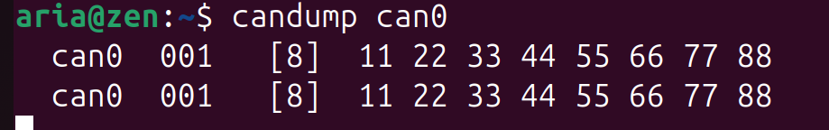

# get_started_with_CAN_on_Ubuntu

## Prep

Before you start with this tutorial, make sure you have a USB to CAN Adapter. For this tutorial, I used RHO2.

## Enabling CAN

Open your terminal and run: 

```bash
sudo modprobe can
sudo modprobe can_raw
sudo apt-get install can-utils
```

And if you run:


```bash
ip a
```
Your output should be something like:

```bash
jinm@Aspire :~$ ip a
... ...
9: can0: <NOARP ,ECHO > mtu 16 qdisc noop state DOWN group default qlen 10
link/can
```

## Bringing Up CAN

By default, all CAN interfaces are down, and we need to bring them up before use it. To do this, run: 

```bash
sudo ip link set can0 type can bitrate 500000
sudo ip link set can0 up
```
To see if a CAN is up or not, send a message using it as shown below:

```bash
cansend can0 123# abcdabcd
```

If there is nothing returned, that means it is working.

## Testing CAN on Command Line

For this part you will need to open the link below and follow the Loopback Test Section:
*https://notes.rdu.im/system/linux/canbus/#loopback-test

Your receiving terminal should look something like this:



## Transmitting CAN Message in C++

CAN messages also can be transmitted through programs. This is what we need to run our robot. Download hello_can.cpp and put it somewhere dedicated to CAN.

This C++ file can be built on the command line with:

```bash
sudo apt update
sudo apt install build-essential
g++ hello_can.cpp -o hello_can
```

Now, we can run the code with:

```bash
./hello_can
```

And it should return:


```bash
CAN 'Hello World!' frame sent successfully on can0.
```
