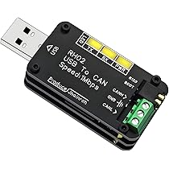
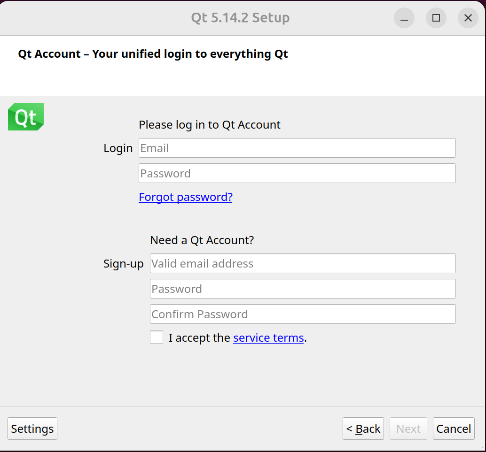
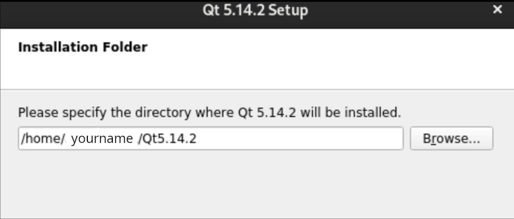
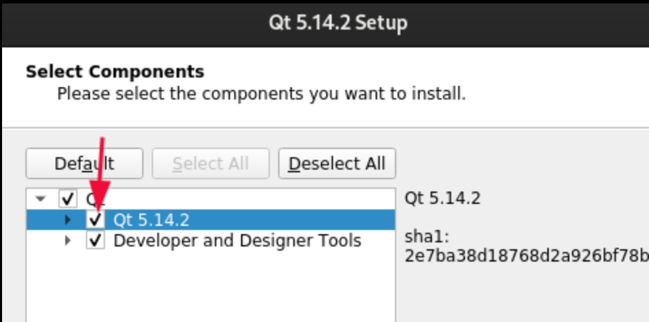

# get_started_with_CAN_on_Ubuntu

## Prep

Before you start with this tutorial, make sure you have a USB to CAN Adapter. For this tutorial, I used RH02.



## Enabling CAN

These commands are referenced from Nvidia (Link in Reference Section)

Open your terminal and run: 

```bash
# load the CAN kernel drivers
sudo modprobe can
sudo modprobe can_raw
# for socketCAN
sudo apt-get install can-utils
```

And if you run:


```bash
ip a
```
Your output should be something like:

```bash
name@Aspire :~$ ip a
... ...
9: can0: <NOARP ,ECHO > mtu 16 qdisc noop state DOWN group default qlen 10
link/can
```

## Bringing Up CAN

By default, all CAN interfaces are down, and we need to bring them up before use it. To do this, run: 

```bash
# set bitrate
sudo ip link set can0 type can bitrate 500000
sudo ip link set can0 up
```
To see if a CAN is up or not, send a message using it as shown below:

```bash
# send on one terminal
cansend can0 123#abcdabcd
```

If there is nothing returned, that means it is working.

## Testing CAN on Command Line

For this part you will need to open the link below and follow the Loopback Test Section:
* https://notes.rdu.im/system/linux/canbus/#loopback-test

Your sending terminal should have no output.

Your receiving terminal should look something like this:


## Transmitting CAN Message in C++

CAN messages also can be transmitted through programs. This is what we need to run our robot. Download hello_can.cpp and put it somewhere dedicated to CAN.

This C++ file can be built on the command line with:

```bash
# Install building tools if you have not already done so
sudo apt update
sudo apt install build-essential
g++ hello_can.cpp -o hello_can
```

Now, we can run the code with:

```bash
./hello_can
```

And it should return:


```bash
CAN 'Hello World!' frame sent successfully on can0.
```

## Streaming CAN Bus with SavvyCAN

### Installation

It may be tricky to install SavvyCAN on Linux. I have been able to install it by following the Logos Red tutorial mostly. However, if your Ubuntu is newer than or is 21.0, then you can't follow the tutorial exactly.

First, you want to install the following libraries. Run:

```bash
sudo apt update
sudo apt install qtbase5-dev qtchooser qt5-qmake qtbase5-dev-tools
```

Run the following command to download the .run file

```bash
wget "https://download.qt.io/archive/qt/5.14/5.14.2/qt-opensource-linux-x64-5.14.2.run"
```

After the file is downloaded, change permissions for it and run it.

```bash
sudo chmod +x qt-opensource-linux-x64-5.14.2.run
./qt-opensource-linux-x64-5.14.2.run
```
After you run the command, a screen like the picture below should pop up.



After you get past that screen, keep going until you hit the installation path screen. When you hit the installation path screen, make sure it looks like the picture below.

Remember your installation path, it’s under:

/home/your_username/QT5.14.2



Make sure you check this box and continue with the installation:



### Compiling SavvyCAN

First, we need to clone the repository with:

```bash
git clone https://github.com/collin80/SavvyCAN.git
cd SavvyCAN
git checkout V213
```

Then we need to build the makefiles with qmake (depending on where you installed it) using: 

```bash
~/Qt5.14.2/5.14.2/gcc_64/bin/qmake
```

At last, run:

```bash
make
```

This is a modified version of: https://logos-red.com/blog/savvycan-installation-guide-building-and-compiling-from-source/

## References
* https://docs.nvidia.com/jetson/archives/r35.4.1/DeveloperGuide/text/HR/ControllerAreaNetworkCan.html
* https://notes.rdu.im/system/linux/canbus/#loopback-test
* https://logos-red.com/blog/savvycan-installation-guide-building-and-compiling-from-source/
