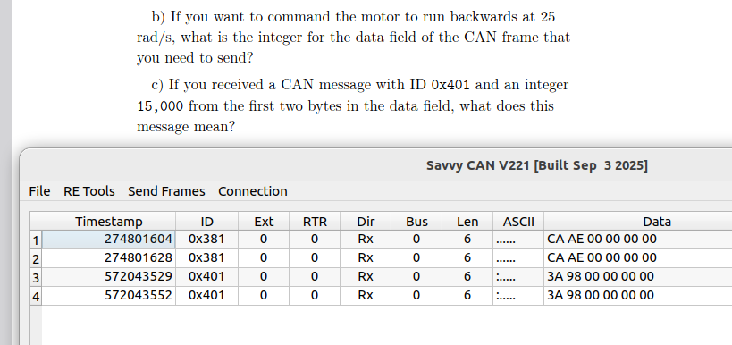

## ✅ Correct Dependency List for Jetson (Ubuntu 22.04)

Try installing with:

```bash
sudo apt update
sudo apt install qml-module-qtquick-controls qml-module-qtquick-controls2 \
                 qml-module-qtquick-dialogs qml-module-qtquick-layouts \
                 qml-module-qtquick2 qml-module-qtquick-window2 \
                 libqt5serialport5-dev libqt5serialbus5-dev \
                 qtdeclarative5-dev qtbase5-dev qttools5-dev \
                 qttools5-dev-tools qtquickcontrols2-5-dev \
                 libqt5help5
```

---

## ✅ Build Again

After installing, re-run:

```bash
cd ~/SavvyCAN
qmake SavvyCAN.pro
make -j4
```

If successful, you should now see the `SavvyCAN` binary in your folder.

---


